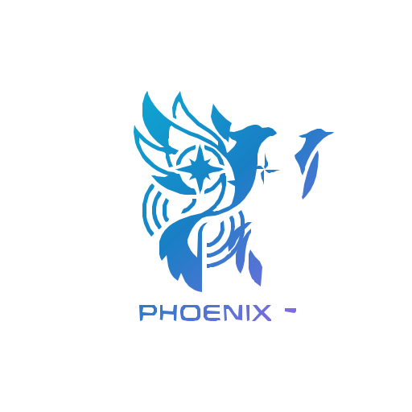

<p align="center">
  
</p>

<h1 align="center">Phoenix — Drone Search & Rescue System</h1>

<p align="center">
  <em>Real-time ground control station for AI-assisted drone search and rescue operations.</em>
  <br />
  <strong>ResQer</strong> — your smart companion in disaster zones.
</p>

<p align="center">
  
  
  
  
  
  
</p>

---

## Overview

Phoenix is a three-tier drone ground control system for search and rescue operations. A mobile application receives real-time video feeds, AI-powered human detection overlays, and live telemetry from a drone, enabling rescue teams to coordinate missions from the field.

The system comprises three components:

- **Raspberry Pi (onboard the drone)** — Captures video and GPS data; streams video via TCP and syncs location via Firebase.
- **Laptop Server** — FastAPI-based middleware that receives drone video, runs AI detection (YOLO), and broadcasts processed frames and detections to mobile clients over WebSockets.
- **Flutter Mobile App** — The ground control interface with live video, interactive maps, drone telemetry, virtual joystick control, and mission management.

---

## Screenshots

> *Replace these with actual screenshots of your app.*

| Onboarding | Sign In | Home Dashboard | Map Tracking | Fullscreen Video |
|------------|---------|----------------|--------------|------------------|
| &nbsp; | &nbsp; | &nbsp; | &nbsp; | &nbsp; |

---

## Features

### Core Capabilities

| Feature | Description |
|---------|-------------|
| **Live Video Streaming** | Real-time video feed from the drone camera via WebSocket with Normal, Thermal, and AI Overlay modes |
| **AI Human Detection** | YOLO-based object detection with bounding boxes, confidence scores, and system status labels rendered as a HUD overlay |
| **GPS Tracking** | Real-time drone location tracking on OpenStreetMap with path history and user location |
| **Telemetry Monitoring** | Battery level, altitude, speed, temperature, and human detection count displayed via circular indicators and stats bars |
| **Virtual Joystick** | Full-screen touch-based joystick for remote drone control (move, start/stop mission, land) |
| **Mission Management** | Plan, start, and monitor rescue missions with status tracking |
| **Reports & Alerts** | Real-time incident reports (human detected, system overheated, mission complete) with timestamps |
| **Authentication** | Email/password sign-up, sign-in, Google/Apple OAuth, password reset flow, and OTP verification |

### UX & Design

| Feature | Description |
|---------|-------------|
| **Responsive UI** | Built with `flutter_screenutil` for adaptive layouts across phone and tablet sizes |
| **Onboarding Flow** | 4-page animated carousel introducing the system to new users |
| **Dark-first Theme** | Professional dark interface suitable for outdoor field operation |
| **Animated Transitions** | Snackbar, page, and state transitions with smooth animations |

---

## Tech Stack

### Flutter Application

| Category | Technology |
|----------|-----------|
| **Framework** | Flutter 3.12+ (Dart SDK ^3.12.0) |
| **State Management** | BLoC / Cubit (`flutter_bloc`) with sealed state classes and `Equatable` |
| **Navigation** | Declarative routing via `go_router` |
| **DI** | Service locator pattern with `get_it` |
| **Maps** | OpenStreetMap via `flutter_map` + `latlong2` |
| **Video Streaming** | `web_socket_channel` (MJPEG over WebSocket) |
| **Authentication** | Firebase Auth + `google_sign_in` |
| **Database** | Cloud Firestore (real-time streams) |
| **Local Storage** | `shared_preferences` |
| **HTTP Client** | `dio` (error handling / future API integration) |
| **Error Handling** | Functional `Either` type via `dartz` |
| **SVG Rendering** | `flutter_svg` |

### Backend Server

| Category | Technology |
|----------|-----------|
| **Framework** | FastAPI 0.115 (Python 3.10+) |
| **Server** | Uvicorn 0.30 (ASGI) |
| **Video Processing** | OpenCV, NumPy, Pillow |
| **AI Detection** | YOLO via custom detection pipeline (with dummy fallback) |
| **Real-time** | WebSockets (video, detections, commands) |
| **TCP Receiver** | Async socket server for drone video ingestion |
| **Firebase** | Firebase Admin SDK (optional server-side ops) |

### Hardware (Drone)

| Component | Role |
|-----------|------|
| **Raspberry Pi** | Onboard computer for GPS + camera + data relay |
| **Camera Module** | Video capture for live streaming |
| **GPS Module** | Real-time location reporting to Firestore |

---

## Architecture

```
┌─────────────────┐     TCP Video     ┌─────────────────────┐     WebSocket      ┌──────────────────────┐
│                 │ ──────────────────▶│                     │ ──────────────────▶│                      │
│  Raspberry Pi   │     Stream        │   FastAPI Server    │    Video + Detects  │   Flutter Mobile App │
│  (Onboard)      │                   │   (Laptop)          │                     │   (Ground Control)   │
│                 │◀──────────────────│                     │◀────────────────────│                      │
│  - Camera       │     Commands      │   - AI Detection    │     Commands        │  - Live Video Feed   │
│  - GPS Module   │     (Firestore)   │   - Thermal Analysis │                     │  - Map Tracking      │
│  - Sensors      │                   │   - Frame Processing │                     │  - Telemetry Display │
└─────────────────┘                   └─────────────────────┘                     │  - Joystick Control  │
                                                                                  │  - Mission Manager   │
                                                                                  └──────────────────────┘
```

### Data Flow

1. **Drone → Firestore**: Raspberry Pi writes GPS location, telemetry (battery, height, speed, temperature), and status to Cloud Firestore in real-time.
2. **Drone → Server**: Raspberry Pi streams MJPEG video frames over TCP (port 9000) to the laptop server.
3. **Server → App (WebSocket)**: The server processes each frame (resize, AI detection, thermal analysis) and broadcasts the result over two WebSocket channels: `/ws/video` (JPEG bytes) and `/ws/detections` (JSON bounding boxes + thermal data).
4. **App → Server (WebSocket)**: The mobile app sends commands (move, start_mission, stop_mission, land) over `/ws/commands`.
5. **App ← Firestore**: The mobile app subscribes to Firestore stream snapshots for real-time drone location, status, and reports.

### Clean Architecture (Feature-First)

```
lib/
├── core/                          # Shared infrastructure
│   ├── di/                        # Dependency injection (GetIt)
│   ├── router/                    # GoRouter configuration
│   ├── theme/                     # Colors, dimensions, ThemeData
│   ├── websocket/                 # WS client + bridge + detection models
│   ├── error/                     # Failure classes
│   ├── utils/                     # SharedPreferences, location utils
│   └── widgets/                   # Shared UI components
└── features/                      # Feature modules
    ├── auth/                      # Auth flow (sign-up, sign-in, OTP, reset)
    ├── drone/                     # Main drone interface (video, map, telemetry, control)
    ├── onboarding/                # Onboarding carousel
    └── splash/                    # App entry + auth gate
```

Each feature follows a 3-layer structure:

```
feature/
├── data/           # Repository implementations (Firebase, etc.)
├── domain/         # Abstract repositories, domain models
└── presentation/   # Cubits (BLoC), screens, widgets
```

---

## Project Structure

```
graduatio_project/
├── android/                        # Platform: Android
├── ios/                            # Platform: iOS
├── web/                            # Platform: Web
├── linux/                          # Platform: Linux
├── macos/                          # Platform: macOS
├── windows/                        # Platform: Windows
├── assets/
│   ├── icons/                      # SVG icons (Google, Apple)
│   ├── images/
│   │   ├── onboarding/             # 4 onboarding illustrations
│   │   └── splash/                 # App logo (Phoenix.svg)
│   └── map/                        # Map placeholder assets
├── laptop_server/                  # FastAPI backend
│   ├── ai_integration/             # AI detection + pipeline
│   │   ├── detector.py             # YOLO detector (with dummy fallback)
│   │   └── pipeline.py             # Frame processing pipeline
│   ├── broadcast/                  # WebSocket manager
│   │   └── ws_manager.py           # Client connection management
│   ├── receivers/                  # TCP video receiver
│   │   └── tcp_receiver.py         # Async TCP server (port 9000)
│   ├── config.py                   # Server configuration
│   ├── main.py                     # FastAPI entrypoint
│   └── requirements.txt            # Python dependencies
├── lib/                            # Flutter source
│   ├── core/
│   │   ├── di/service_locator.dart
│   │   ├── error/failure.dart
│   │   ├── helper/show_snak_bar.dart
│   │   ├── router/app_router.dart
│   │   ├── theme/
│   │   │   ├── app_dimensions.dart
│   │   │   └── app_theme.dart
│   │   ├── utils/
│   │   │   ├── local_storage_service.dart
│   │   │   └── location_utils.dart
│   │   ├── websocket/
│   │   │   ├── connection_status.dart
│   │   │   ├── drone_ws_bridge.dart
│   │   │   └── ws_client.dart
│   │   └── widgets/
│   │       ├── gradient_button.dart
│   │       ├── onboarding_page_indicator.dart
│   │       └── svg_asset_image.dart
│   ├── features/
│   │   ├── auth/
│   │   │   ├── data/auth_repository_impl.dart
│   │   │   ├── domain/auth_repository.dart
│   │   │   └── presentation/
│   │   │       ├── cubit/
│   │   │       │   ├── auth_cubit.dart
│   │   │       │   └── auth_state.dart
│   │   │       └── screens/
│   │   │           ├── widgets/
│   │   │           │   ├── auth_text_field.dart
│   │   │           │   ├── otp_input_field.dart
│   │   │           │   └── social_sign_in_button.dart
│   │   │           ├── forgot_password_screen.dart
│   │   │           ├── new_password_screen.dart
│   │   │           ├── otp_screen.dart
│   │   │           ├── sign_in_screen.dart
│   │   │           └── sign_up_screen.dart
│   │   ├── drone/
│   │   │   ├── data/drone_repository_impl.dart
│   │   │   ├── domain/
│   │   │   │   ├── drone_location.dart
│   │   │   │   ├── drone_report.dart
│   │   │   │   ├── drone_repository.dart
│   │   │   │   └── drone_status.dart
│   │   │   └── presentation/
│   │   │       ├── cubit/
│   │   │       │   ├── drone_status_cubit.dart
│   │   │       │   ├── drone_status_state.dart
│   │   │       │   ├── drone_tracking_cubit.dart
│   │   │       │   ├── drone_tracking_state.dart
│   │   │       │   ├── video_feed_cubit.dart
│   │   │       │   └── video_feed_state.dart
│   │   │       ├── screens/
│   │   │       │   ├── drone_fullscreen_video_screen.dart
│   │   │       │   ├── drone_home_screen.dart
│   │   │       │   ├── drone_main_shell.dart
│   │   │       │   └── drone_map_screen.dart
│   │   │       └── widgets/
│   │   │           ├── ai_detection_overlay.dart
│   │   │           ├── connection_status_bar.dart
│   │   │           ├── drone_bottom_nav_bar.dart
│   │   │           ├── drone_circular_indicator.dart
│   │   │           ├── drone_map_content.dart
│   │   │           ├── drone_map_status_bar.dart
│   │   │           ├── drone_map_view.dart
│   │   │           ├── drone_stat_item.dart
│   │   │           ├── drone_stats_bar.dart
│   │   │           ├── drone_status_card.dart
│   │   │           ├── grid_painter.dart
│   │   │           ├── joystick_painter.dart
│   │   │           ├── map_markers.dart
│   │   │           ├── map_placeholder.dart
│   │   │           ├── map_screen_header.dart
│   │   │           ├── mission_button.dart
│   │   │           ├── mission_status_card.dart
│   │   │           ├── report_tile.dart
│   │   │           ├── reports_section.dart
│   │   │           ├── simulated_feed.dart
│   │   │           ├── start_mission_button.dart
│   │   │           ├── video_back_button.dart
│   │   │           ├── video_feed_background.dart
│   │   │           ├── video_mode_toggle.dart
│   │   │           ├── video_preview_card.dart
│   │   │           └── virtual_joystick.dart
│   │   ├── onboarding/
│   │   │   ├── cubit/
│   │   │   ├── onboarding_data.dart
│   │   │   └── onboarding_screen.dart
│   │   └── splash/
│   │       └── splash_screen.dart
│   ├── firebase_options.dart
│   └── main.dart
├── test/
├── pubspec.yaml
└── analysis_options.yaml
```

---

## Installation

### Prerequisites

- Flutter SDK ^3.12.0 ([install guide](https://docs.flutter.dev/get-started/install))
- Dart SDK ^3.12.0
- Python 3.10+
- A Firebase project with Authentication and Firestore enabled
- Android Studio / Xcode (for device builds)

### Clone & Dependencies

```bash
git clone https://github.com/your-org/phoenix-drone.git
cd phoenix-drone

# Install Flutter dependencies
flutter pub get

# Install Python server dependencies
cd laptop_server
pip install -r requirements.txt
cd ..
```

---

## Firebase Setup

1. Create a Firebase project at [console.firebase.google.com](https://console.firebase.google.com).
2. Enable **Authentication** providers: Email/Password, Google, Apple (optional).
3. Create a **Cloud Firestore** database.
4. Register your app platforms (Android, iOS, Web) in Firebase Console.
5. Install the FlutterFire CLI and configure:

```bash
dart pub global activate flutterfire_cli
flutterfire configure --project=your-firebase-project-id
```

This generates `lib/firebase_options.dart` with your platform-specific Firebase credentials.

### Firestore Data Schema

```
drone/                          # Root collection
├── location/                   # Document: real-time GPS
│   ├── lat: double
│   ├── lng: double
│   └── timestamp: Timestamp
├── status/                     # Document: telemetry
│   ├── battery: int
│   ├── humanCount: int
│   ├── height: double
│   ├── speed: double
│   ├── isConnected: bool
│   └── temperature: double
├── commands/                   # Document: outbound commands
│   ├── command: string
│   ├── data: map
│   └── timestamp: Timestamp
└── reports/                    # Document
    └── entries/                # Subcollection: incident reports
        └── {docId}
            ├── type: string
            ├── message: string
            └── timestamp: Timestamp

users/                          # Root collection
└── {uid}/                      # User profile
    ├── uid: string
    ├── email: string
    └── createdAt: Timestamp
```

---

## Environment Configuration

The server IP address and WebSocket URLs are configured in `lib/core/di/service_locator.dart`. Update these values to match your network:

```dart
// lib/core/di/service_locator.dart
const String _serverIp = '192.168.1.10'; // Change to your server's IP
const int _serverPort = 8000;

final videoUrl = 'ws://$_serverIp:$_serverPort/ws/video';
final detectionUrl = 'ws://$_serverIp:$_serverPort/ws/detections';
final commandUrl = 'ws://$_serverIp:$_serverPort/ws/commands';
```

For production, consider moving configuration to environment variables or a config file.

### Server Configuration

```python
# laptop_server/config.py
TCP_PORT = 9000           # Port for Pi video stream
WS_PORT = 8000            # Port for WebSocket server
FRAME_WIDTH = 640         # Processing resolution
FRAME_HEIGHT = 480
JPEG_QUALITY = 75         # Compression quality
```

---

## Running the Project

### 1. Start the Backend Server

```bash
cd laptop_server
python main.py
```

The server starts on `http://0.0.0.0:8000` with:
- `GET /health` — Health check endpoint
- `WS /ws/video` — Video stream broadcast
- `WS /ws/detections` — AI detection data broadcast
- `WS /ws/commands` — Command reception from mobile

### 2. Run the Flutter App

```bash
# For development
flutter run

# For a specific device
flutter run -d <device-id>

# List available devices
flutter devices
```

The app launches to the splash screen, checks authentication state, and navigates to onboarding (first launch) or the main drone dashboard.

---

## Building for Production

```bash
# Android APK
flutter build apk --release

# Android App Bundle (Play Store)
flutter build appbundle --release

# iOS (requires macOS + Xcode)
flutter build ios --release

# Web
flutter build web --release
```

---

## State Management

The project uses the **BLoC / Cubit** pattern from `flutter_bloc`. Five cubits manage distinct concerns:

| Cubit | Responsibility | States |
|-------|---------------|--------|
| `AuthCubit` | Authentication flow (sign-up, sign-in, OTP, password reset, Google OAuth) | `AuthInitial`, `AuthLoading`, `AuthSuccess`, `AuthFailureState`, `OtpSent`, `PasswordResetEmailSent` |
| `OnboardingCubit` | Onboarding page navigation | `OnboardingState(currentPage)` |
| `DroneTrackingCubit` | Real-time GPS location + path history via Firestore streams | `DroneTrackingInitial`, `Loading`, `Active`, `Disconnected` |
| `DroneStatusCubit` | Telemetry data + incident reports | `DroneStatusInitial`, `DroneStatusLoaded` |
| `VideoFeedCubit` | Video mode (normal/thermal/overlay) + fullscreen toggle | `VideoFeedState(mode, isFullscreen)` |

### Pattern

- **Immutable state classes** with `Equatable` for value equality and change comparison.
- **Sealed state hierarchies** enable exhaustive pattern matching in `BlocBuilder`/`BlocSelector`/`BlocListener`.
- **`MultiBlocProvider`** scopes cubits to the widget tree in `DroneMainShell`.
- **`GetIt` service locator** registers cubits as `lazySingleton` or `factory` for dependency injection.

---

## API / Backend

### WebSocket Endpoints

| Endpoint | Direction | Format | Description |
|----------|-----------|--------|-------------|
| `/ws/video` | Server → Client | Binary (JPEG bytes) | Processed video frames at ~15-30 FPS |
| `/ws/detections` | Server → Client | JSON | AI detection results: bounding boxes, confidence, thermal data |
| `/ws/commands` | Bidirectional | JSON | Mobile sends: `move`, `start_mission`, `stop_mission`, `land`. Server may acknowledge. |

### Detection JSON Format

```json
{
  "detections": [
    {
      "label": "person",
      "confidence": 0.92,
      "x": 0.35,
      "y": 0.25,
      "w": 0.12,
      "h": 0.30
    }
  ],
  "thermal": {
    "avg_temp": 36.5,
    "max_temp": 37.2,
    "overheated": false
  }
}
```

### Server Processing Pipeline

```
TCP Receiver (port 9000) → Frame Queue → Pipeline (resize + detect + encode) → Output Queue → Broadcaster → WS Clients
```

### Health Check

```bash
curl http://localhost:8000/health
# {"status": "healthy", "clients": {"video": 1, "detection": 1, "command": 0}}
```

---

## Responsive & Adaptive Design

The UI is built with `flutter_screenutil` using a base design size of 393 × 852 (iPhone-like profile). All dimensions, fonts, and spacing scale proportionally across screen sizes.

```dart
// main.dart — responsive configuration
ScreenUtilInit(
  designSize: const Size(393, 852),
  minTextAdapt: true,
  splitScreenMode: true,
  child: const PhoenixApp(),
)
```

Key decisions:
- **Layout widgets** use `ScreenUtil` extensions (`.w`, `.h`, `.sp`, `.r`) for proportional sizing.
- **Bottom navigation** and **control overlays** adapt to safe areas on notched devices.
- **The map** fills available space using `Expanded` with status bars overlaid.
- **Video preview** maintains 16:9 aspect ratio with `AspectRatio` widget.

---

## Performance Optimizations

| Area | Approach |
|------|----------|
| **Video Streaming** | MJPEG-over-WebSocket with compressed JPEG frames (quality: 75); frames processed server-side before transmission |
| **State Updates** | Cubit `BlocSelector` for granular rebuilds; `Equatable` prevents unnecessary notifications |
| **Firestore Streams** | Single-document listeners (not collection scans) with server timestamps |
| **Map Rendering** | `flutter_map` with OpenStreetMap raster tiles (no WebGL overhead); polyline path uses simplified coordinate set |
| **AI Detection** | Server-side YOLO processing; only detection metadata (no full frames) sent as JSON |
| **Asset Loading** | SVG images with in-memory caching via `flutter_svg` |
| **Widget Tree** | Minimal rebuilds via `const` constructors and `BlocBuilder` granularity |
| **Disconnect Handling** | 10-second timeout timer in `DroneTrackingCubit` — avoids brief network blips triggering disconnected states |

---

## Roadmap

- [x] Firebase Authentication (email/password, Google, Apple)
- [x] Real-time drone GPS tracking with path history
- [x] Live video streaming with mode switching
- [x] AI human detection overlay
- [x] Virtual joystick drone control
- [ ] Raspberry Pi hardware implementation & integration
- [ ] YOLO model fine-tuning for aerial SAR datasets
- [ ] Offline mode with cached map tiles
- [ ] Multi-drone support (fleet management)
- [ ] Push notifications for critical detections
- [ ] Mission history replay
- [ ] Automated flight path planning
- [ ] End-to-end encryption for video stream

---

## Contributing

1. Fork the repository.
2. Create a feature branch: `git checkout -b feat/your-feature`
3. Commit changes: `git commit -m "feat: add your feature"`
4. Push: `git push origin feat/your-feature`
5. Open a pull request.

### Guidelines

- Follow [Clean Architecture](https://blog.cleancoder.com/uncle-bob/2012/08/13/the-clean-architecture.html) and the existing feature-first structure.
- Use BLoC/Cubit for state management — no direct `setState` in feature code.
- Write immutable state classes with `Equatable`.
- Keep widgets focused — extract reusable components to feature-level widget directories.
- Run `flutter analyze` before committing.

---

## License

Distributed under the MIT License. See `LICENSE` for more information.

---

## Contact

**Project Team** — Graduation Project 2026

---

<p align="center">
  Built with Flutter, Firebase, and FastAPI.
</p>
